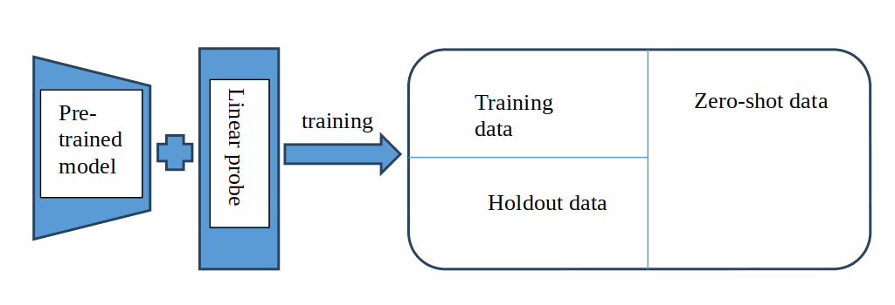

Benchmarking Test for deep network generalization

This repo covers an implementation for the Generalisation Benchmarking Test for Deep Networks, using CIFAR as an example. The illustration of Benchmarking bed is shown below:
<p align="center">
  
</p>

## Installation
To set up the environment:
```
conda env create -f environment.yml
```

## Running
You might use `CUDA_VISIBLE_DEVICES` to set proper number of GPUs, and/or switch to CIFAR10 by `--dataset cifar10`.  
**(1) linear probe**

First, Apply linear probe to your model and save the result for future use. 
```
python linear_probe.py --batch_size 64 \
  --learning_rate 1e-4 \
```

**(2) Calculate accuracy and kappa**  
You need to modify the file location and different setting according to your situation. 
```
python  calculate_accuracy.py
python  calculate_kappa.py
```
**(3) Find the Tradeoff point and output the bound** 
You need to modify the file location and different setting according to your situation. 
```
python  trade_off_point.py

```
The final result of our benchmark is like this:
## Model Comparison

| MODEL             | CLIP     |
|-------------------|----------|
| GENERALIZATION BOUND | 0.308677 |
| DIVERSITY BOUND   | 0.293403 |
| SSIM              | 0.65     |
| ZERO-SHOT%        | 0        |
| MODEL SIZE        | 38M      |

