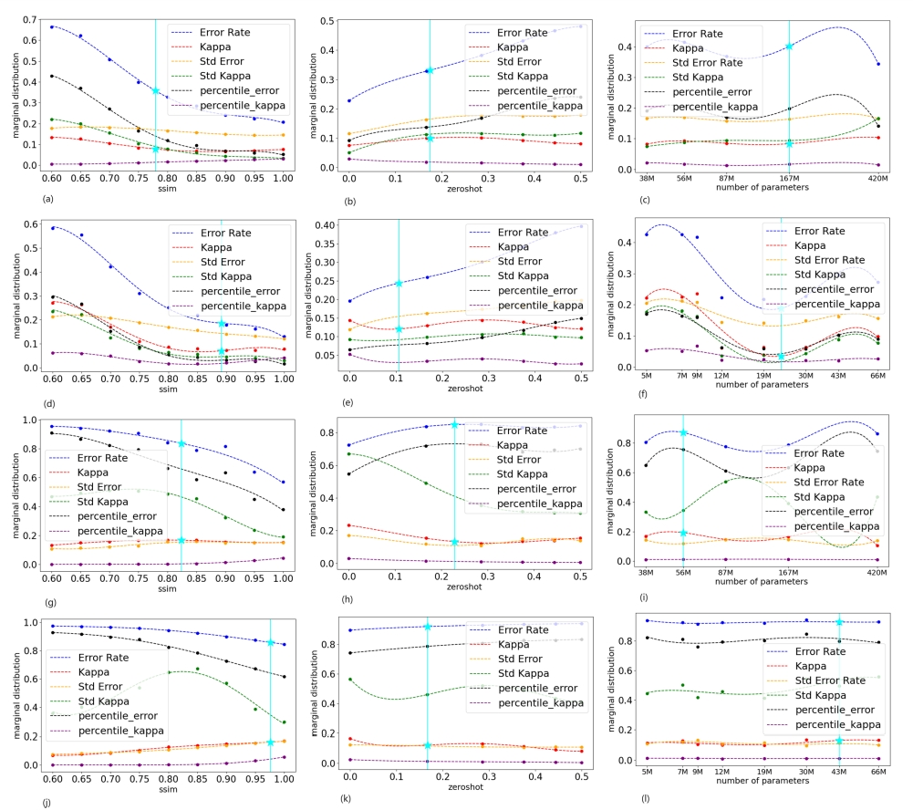

# A Testbed for Assessing Generalization Capacity of Deep Neural Networks

This repository presents the code implementation of the paper '[A practical generalization metric for deep networks benchmarking](https://arxiv.org/pdf/2409.01498)'.

Benchmarking is conducted on the CIFAR-100 dataset, with only 50 randomly selected object classes used for training. The remaining classes are reserved for zero-shot testing.

Each pre-trained model is fine-tuned on CIFAR-100 to adapt itself to this task. Subsequently, various model variants are created by adding a single linear probe layer for subsequent zero-shot performance evaluation.

These models are then tested, collecting metrics such as error rate and kappa. Finally, the trade-off point between these metrics is calculated and visualized in graphs, ready for analysis.
<p align="center">
  
</p>


## Prerequisites 

| | Command | Notes |
| - | - | - |
| Pytorch | `conda install pytorch torchvision torchaudio pytorch-cuda=11.8 -c pytorch -c nvidia` |Depending on the GPU configuration, go to https://pytorch.org for more details|
| scikit-learn| `conda create -n sklearn-env -c conda-forge scikit-learn` `conda activate sklearn-env`| |
| EfficientNet_PyTorch | `pip install efficientnet_pytorch` | |
| Pandas | `pip install pandas` | |
| utils | `pip install utils` |  |
| h5py  | `pip install h5py` | |
| SciPy | `pip install scipy`| |
| Matplotlib| `pip install matplotlib`| |


## Running

For better navigability, the process is divided into multiple scripts.

Use `CUDA_VISIBLE_DEVICES` to set proper number of GPUs, and/or switch to imagenet by `--dataset 
imagenet`.  

**Step 1. Model Preparetion**

First, all pre-trained models are fine-tuned on CIFAR-100 and then saved.

```
python train.py
```
To enable zero-shot testing, a linear probe layer is added to the tuned model to match the desired output dimension, followed by fine-tuning. The resulting models are then saved.

```
python linear_probe.py
```

**Step 2. Evaluating( ErrorRate and Kappa )**

The performance of pre-trained CLIP and EfficientNet models is evaluated across three dimensions: zero-shot percentage, weight number, and Structural Similarity Index (SSIM). 

The error rates and Kappas for each class are recorded in the corresponding cells of a 3D array.

```
python calculate_error.py
python calculate_kappa.py
```

The following script calculates three types of statistics for the distributions of Error Rate and Kappa across all classes: mean, standard deviation, and 10th percentile. These statistics are updated cell-wise within the 3D array. Please note that you may need to adjust file locations and other settings in the script based on your setup. The final results are saved in an XLSX format file. 

```
python  build_3d_array.py
```

**Step 3.Benchmark Result Calculation( Tradeoff point and The bound )** 

The trade-off points are calculated using Equation 4 from the paper. These points are then visualized based on the three pairs of marginal distributions, as described by Equation 5.

```
python  tradeoff_point.py
python  plot_marginal_distribution.py
```

Also, you may run this script to draw the graphs.
```
python  plot_marginal_distribution.py
```

<p align="center">
  
</p>

## Benchmarking Result

The final result of our benchmark(CLIP model in cifar100) are presented below.

| Dataset      || ImageNet |       | CIFAR-100 |       |
|  Model Type  | CLIP     | EFFICIENT NET | CLIP  | EFFICIENT NET |
| GENERALIZATION BOUND | 0.359    | 0.223 | 0.851     | 0.921 |
| DIVERSITY BOUND    | 0.081    | 0.085 | 0.137     | 0.132 |
| SSIM (lower bound) | 0.900    | 0.906 | 0.614     | 0.848 |
| ZEROSHOT (upper bound) | 0.375    | 0.286 | 0.379     | 0.167 |
| MODEL SIZE (lower bound) | 167M     | 19M  | 92M       | 9.2M  |


