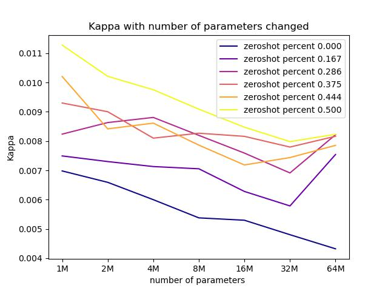
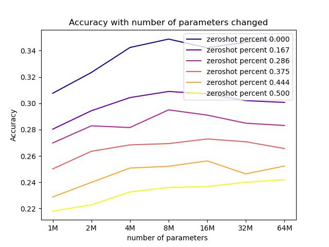
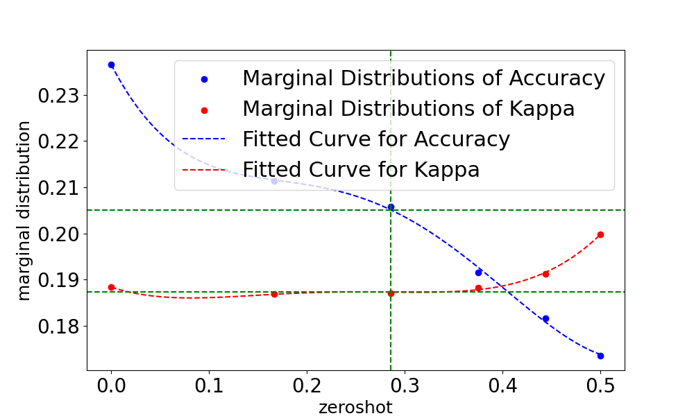

Generalisation Benchmarking Test for Deep Networks

This repo covers an implementation for the Generalisation Benchmarking Test for Deep Networks, using CIFAR as an example. The illustration of Benchmarking bed is shown below:
<p align="center">
  
</p>


## Running
You might use `CUDA_VISIBLE_DEVICES` to set proper number of GPUs, and/or switch to CIFAR100 by `--dataset cifar100`.  
**(1) linear probe**

First, Apply linear probe to your model and save the result for future use. 
```
python linear_probe.py --batch_size 64 \
  --learning_rate 1e-4 \
```
**(2) Sample weight**  
After you finish the linear probe part, it's time to sample the weight from the original model with any window size you want:
```
python Sample_weight.py --window 0.5
```
**(3) Calculate accuracy and kappa**  
You need to modify the file location and different setting according to your situation. 
```
python  calculate_accuracy.py
python  calculate_kappa.py
```
**(3) Plot accuracy and kappa with different parameter changed** 
You need to modify the file location and different setting according to your situation. 
```
python  plot_accuracy_amount.py
python  plot_accuracy_window.py
python  plot_kappa_amount.py
python  plot_kappa_window.py
```
Some example figures of accuracy and kappa is shown below:
<p align="center">
  
</p>

<p align="center">
  
</p>

**(5) Gather all your data in a three dimensional data structure and plot the margin distribution**  
We put our data in a 3d array shown below. After this, we use augmented Lagrangian and find the tradeoff point and plot marginal distribution in the end. 
<p align="center">
  
</p>

```
python gather_acc_kappa.py
python augmented Lagrangian.py
python marginal_distribution.py
```

The margin distribution example is shown below: 
<p align="center">
  
</p>
